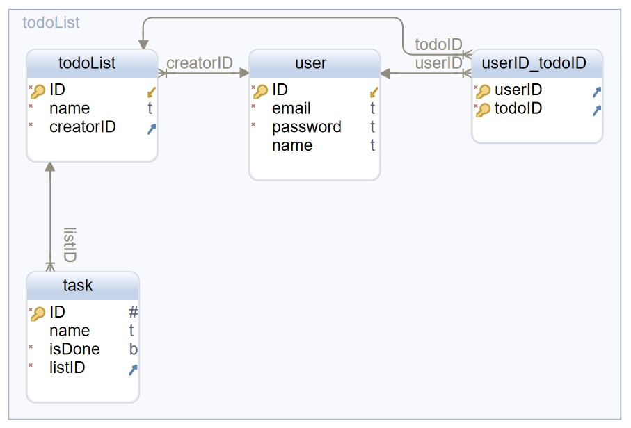
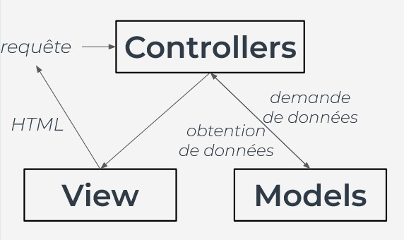
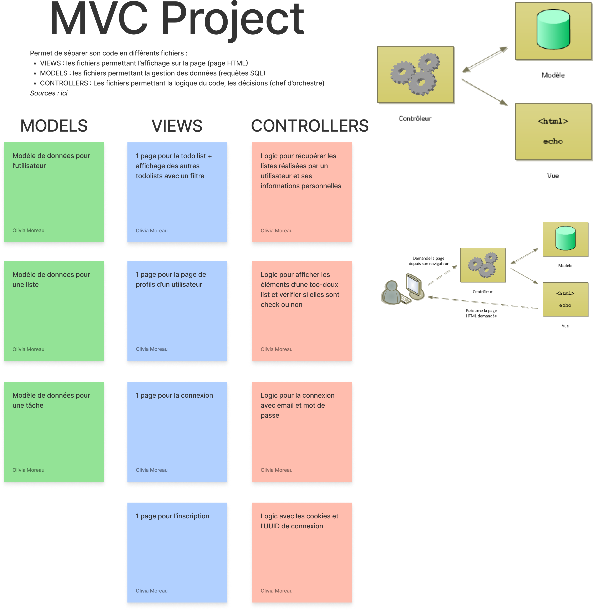
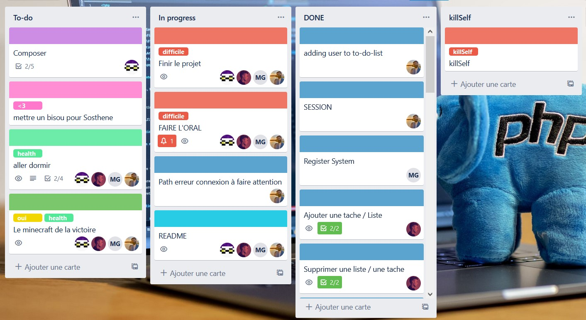
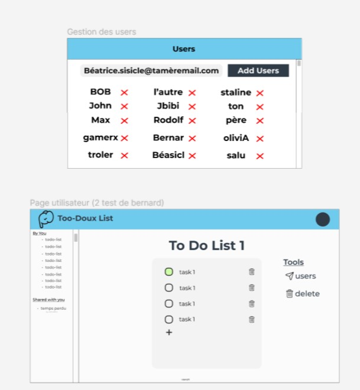

# :clipboard: To-do-list

## :books: Sujet

"The goal of this project is to demonstrate your newly acquired skills in PHPby making a shared to-do list app.The idea is to let people create user accounts, create to-do lists and inviteother users to contribute to it (by adding tasks or marking them as done)."

Les buts principaux sont :
- Système de "**register** et **login**" pour les utilisateurs
- Système de **session**
- **Créer** et **supprimer** des **TodoLists**
- **Créer** et **supprimer** des **Tâches**
- **Marquer** les **Tâches** comme **faites** (ou pas faites).
- **Inviter** des **utilisateurs** pour partager la **todolist**.

## Notre solution

On est fière de vous présenter, **TooDoux List** !

**TooDoux List** est la solution pour votre envie d'oganiser votre vie !

Malheureusement, fait en PHP :sob:, il reste assez utilisable pour bien réussir vos tâches.

## :floppy_disk: Structure

### Structure BDD

## MVC

## :bookmark_tabs: Outils externe (Organisation, Wireframe)

### Utilisation de Trello pour la répartition des tâches.

### Utilisation de Figma

## :gear: Setup

Afin de faire fonctionner le projet, il faut :

- utiliser un serveur Apache (LAMP, MAMP, WAMP, XAMPP).
- autoriser le module de rewrite (mod_rewrite) : tutoriel pour WAMP et XAMPP [ici](https://waytolearnx.com/2019/07/comment-activer-lurl-rewriting-sous-wamp-et-xampp.html). À noter qu'il peut déjà être activer par défaut.
- en fonction du système choisi, il faudra configurer le projet (le placer au bon endroit dans les fichiers, etc...)

Dans notre cas, on a utilisé XAMPP et MAMP, donc il faut :
- Suivre l'installation de XAMPP
- Placer le projet dans le dossier `xampp/htdocs` (Vous pouvez le mettre dans un sous-dossier de ``htdocs``, mais l'addresse du site peut changer).
- autoriser le module de rewrite (mod_rewrite) : tutoriel pour XAMPP [ici](https://waytolearnx.com/2019/07/comment-activer-lurl-rewriting-sous-wamp-et-xampp.html).
- Lancer le serveur Apache, en appuyant sur *Start*.
- Le projet devrait se lancer sur [localhost/home](http://localhost/home) (avec MAMP) ou [localhost/To-do-list/home](http://localhost/home) (avec XAMPP) (Sauf si vous avez changé le dossier du projet : nom, emplacement, etc...).

> :warning: À noter, notre page principale apparaitra sur */home*. (Les 3 liens principaux : */home*, */login*, */register*).